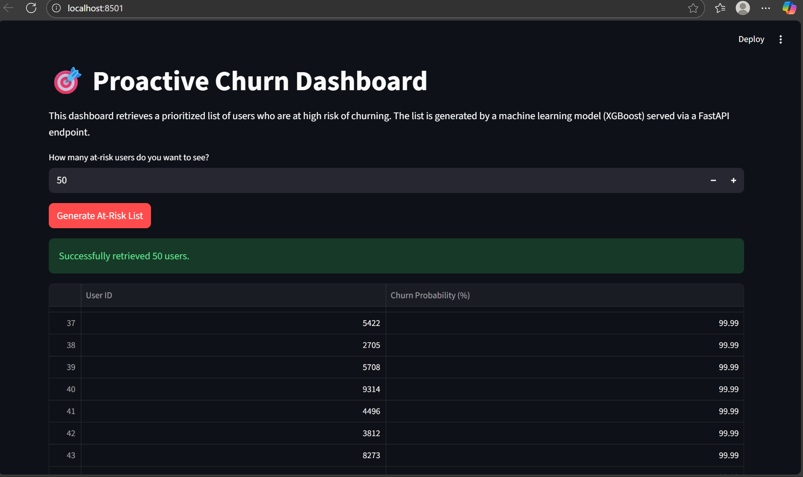

# 🎯 Proactive Customer Churn Reduction System

This is a complete, end-to-end machine learning project that demonstrates a full-stack, production-style system for predicting and managing customer churn.

## 1. The Business Problem (The "Why")

A subscription-based service ("StreamCo") is losing customers, which costs the company money. The retention team has a limited budget for "save" offers (like discounts) and cannot send them to every user.

**Our Goal:** Build a tool that provides a prioritized list of the users who are **most likely to churn**. This allows the retention team to focus their budget and efforts *only* on the highest-risk customers.

## 2. The Solution (The "What")

This project is a full-stack ML application built as a two-part microservice system:

* **🧠 The Brain (FastAPI):** A Python API that loads our champion XGBoost model from an MLflow server. At startup, it pre-calculates the churn probability for all 10,000 users and serves this ranked list instantly via a REST endpoint.
* **👨‍💻 The Face (Streamlit):** A simple, user-friendly web dashboard built for a non-technical "Retention Manager." It calls the FastAPI "brain" and displays the at-risk list in a clean, downloadable table.

This architecture is fast, scalable, and demonstrates a professional, production-ready system, not just a notebook.




## 3. Tech Stack 🛠️

* **Data Science:** Pandas, NumPy, scikit-learn
* **ML Model:** XGBoost
* **Experiment Tracking:** MLflow
* **Backend API:** FastAPI, Uvicorn
* **Frontend UI:** Streamlit

## 4. How to Run This Project

You will need **three separate terminals** running at the same time from the `proactive_churn_project` folder.

---

### Terminal 1: Start the MLflow Server (The "Librarian")

This server hosts the ML model file.

```bash
# 1. Go to the project folder
cd C:\Users\Chethan Vakiti\proactive_churn_project

# 2. Activate the environment
.\venv\Scripts\activate

# 3. Run the MLflow server
mlflow ui

*(Leave this running)*

```
-----

### Terminal 2: Start the API (The "Brain")

This server loads the model and serves predictions.

```bash
# 1. Open a NEW terminal
# 2. Go to the project folder
cd C:\Users\Chethan Vakiti\proactive_churn_project

# 3. Activate the environment
.\venv\Scripts\activate

# 4. Run the API server
uvicorn api.main:app --reload
```

*(Wait for this to print `Application startup complete.` then leave it running)*

-----

### Terminal 3: Start the Dashboard (The "Face")

This server runs the user-facing web app.

```bash
# 1. Open a THIRD terminal
# 2. Go to the project folder
cd C:\Users\Chethan Vakiti\proactive_churn_project

# 3. Activate the environment
.\venv\Scripts\activate

# 4. Run the Streamlit app
streamlit run dashboard.py
```

*(This will automatically open your browser to the dashboard.)*

```
```